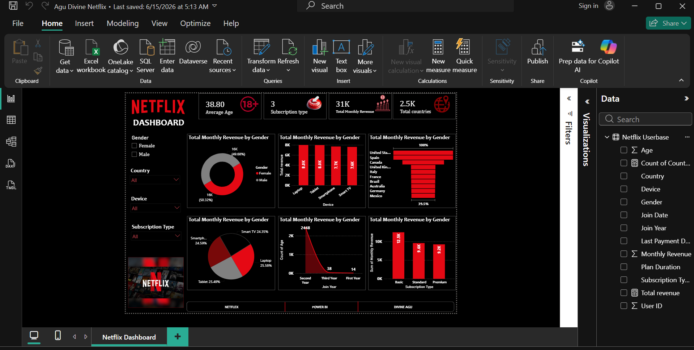

# 🎬 Netflix Content Analysis Dashboard

## 📌 Overview

This project presents an interactive Power BI dashboard that analyzes Netflix's content library to uncover trends in content distribution, genre popularity, release patterns, audience ratings, and country contributions.

The objective of this project is to transform raw Netflix data into meaningful insights that support content strategy and business decision-making.

---

## 🎯 Business Objective

To analyze Netflix's content catalogue and answer key business questions, including:

- What type of content dominates Netflix?
- Which countries contribute the most titles?
- Which genres are most popular?
- How has Netflix's content library grown over time?
- What audience ratings are most common?

---

## 🗂 Dataset

The dataset contains information on Netflix Movies and TV Shows, including:

- Title
- Type
- Genre
- Director
- Cast
- Country
- Release Year
- Date Added
- Rating
- Duration

---

## 🛠 Tools Used

- Microsoft Power BI
- Power Query
- DAX
- Microsoft Excel

---

## 🧹 Data Preparation

The following data preparation steps were carried out:

- Removed duplicate records
- Handled missing values
- Corrected inconsistent data entries
- Converted columns to appropriate data types
- Cleaned and transformed data using Power Query

---

## 📊 Dashboard Features

The dashboard provides insights into:

- Total Movies and TV Shows
- Content Distribution by Type
- Content by Country
- Genre Distribution
- Content Rating Analysis
- Release Year Trends
- Top Content-Producing Countries
- Interactive Filters and Slicers

---

## 📈 Key Insights

- Movies account for the majority of Netflix's content.
- The United States contributes the highest number of titles.
- Drama and International Movies are among the most common genres.
- Netflix experienced significant growth in content additions after 2015.
- Mature audience ratings dominate the platform.

---

## 💡 Recommendations

- Increase investment in underrepresented genres to diversify the content catalogue.
- Continue expanding content in high-performing regions.
- Monitor audience preferences to guide future content acquisition.
- Invest in successful TV Show categories to improve subscriber retention.

---

## 📷 Dashboard Preview

---

## 📁 Repository Structure

Netflix-Content-Analysis/
│── README.md
│── Netflix Dashboard.pbix
│── Netflix Dataset.xlsx
│── dashboard.png

---

## 🚀 Skills Demonstrated

- Data Cleaning
- Data Transformation
- Data Visualization
- Dashboard Development
- Business Intelligence
- DAX
- Power Query
- Analytical Reporting

---

## 👤 Author

**Agu Divine**

**Data Analyst | Business Intelligence | Power BI | SQL | Excel | Python**

LinkedIn: https://www.linkedin.com/in/divine-agu-693a613b0

Email: agudivine213@gmail.com
